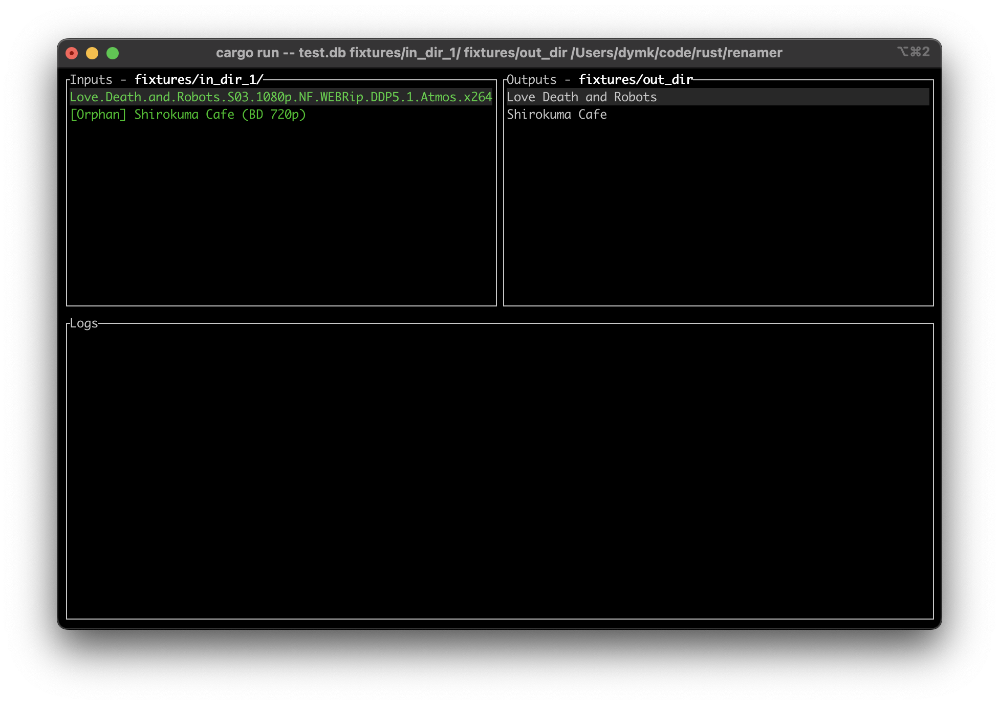
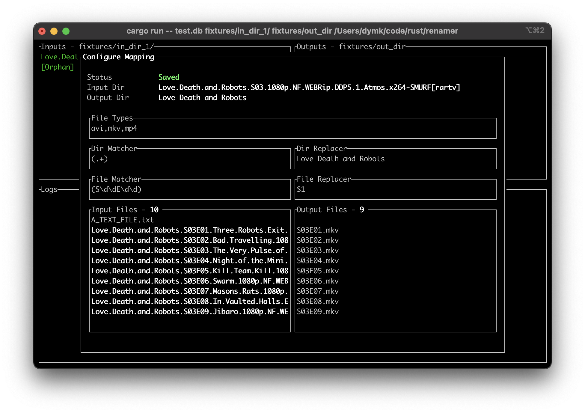

Interactive Renamer
===

An opinionated tool to manage directory trees, where the input trees have names that look like those found in torrents, and the output trees are something that plays well with Plex

```
Usage:
renamer [dbfile] [indir] [outdir]
 dbfile - file to persist mapping information to
 indir - directory containing input files / directories
 outdir - directory to write new directories / symlinks to
```

Building
---

```
$> git clone https://github.com/dymk/interactive-renamer
$> cd interactive-renamer
$> cargo build
```

Features 
===

- Interactive TUI works on servers via ssh
- Real-time preview of file and directory renaming strategies
- Per-directory configuration persisted to local database

Screenshots
===

List input directories and their mapped outputs


Configure renaming strategies for input directories and the files it contains
